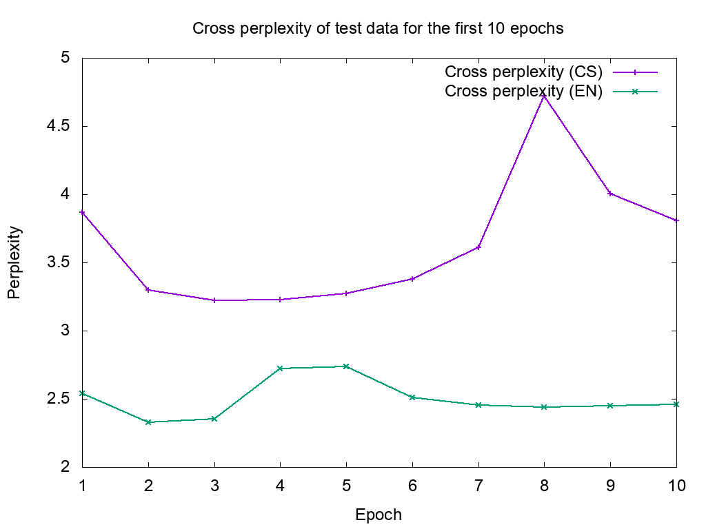

# VybliBibli21Bot

A Recurrent Neural Network (RNN) program to autogenerate texts similar to the Bible.

This code is based on examples by [asayeed](https://github.com/asayeed/lt1) and was written as a solution to [an exercise on RNNs](https://github.com/jonsafari/lt1/blob/master/hw/hw-rnn.md) for [Language Technology I](https://github.com/jonsafari/lt1) in WS2016/17.


## Install

Dependencies: You need to install Keras, h5py and tweepy.


## Usage

First, store your Twitter account credentials into a file called `credentials.py` in the following format:
```
consumer_key = 'abcd'
consumer_secret = 'efgh'
access_token = '1234-ěščř'
access_token_secret = 'ijkl'
```

Then train a model on an UTF-8-encoded corpus by running `train-rnn.py --train model-name-prefix corpus.txt` and get some predictions seeded by another text by running `train-rnn.py --predict full-model-name text-seeds.txt`. Predictions are printed to STDOUT as NULL-terminated UTF-8 strings. The predictions can be piped directly into the twitter part (`twitter.py`), which sends them to the account specified by your credentials.

You can also use the supplied Makefile for ease of use. Run `make train` to train some models and run `make "MODEL_CS=model-name"`


## Description

The model is a character-based RNN built upon Keras. My data are two editions of the Bible, one in Czech (Bible: překlad 21. století) (Bible: the translation for the 21<sup>st</sup> Century) and the other one in English (the King James version). The Czech Bible is 3 710 918 characters long and the King James bible is 4 293 481 characters long. Otherwise, the format I convert them into is identical: Books are started with a headline, each paragraph with its number in parentheses and each verse with its number. The data was obtained from [Zefania XML Bible Markup Language](https://sourceforge.net/projects/zefania-sharp/), files `SF_2016-10-10_CZE_CZEB21_(CZECH BIBLE, PREKLAD 21_STOLETI).xml` and `SF_2009-01-23_ENG_KJV_(KING JAMES VERSION).xml`.

I've tried several RNN layouts before settling on the final one. 2-layer LSTM performed quite well, as did 2 densely connected simple NN layers followed by a single LSTM layer. A single layer of LSTM produced too many ungrammatical words and didn't learn the overarching structure of the Biblical texts too well. More complex NNs overfit too easily and don't have enough variance to generate nice texts.

I tested RNNs of width 256 and 512, they both worked pretty well, but the wider ones were better and trained more reliably, so I've decided to use these. I didn't try using layers of different width.

I've experimented with both stateful and stateless models, but I didn't find any differences between these two, so I decided to stick with the stateless type, which is easier to use. I expected the stateful models to perform better, but either I've used them wrong, or not shuffling the training data held the models back. The code for that is still in there, but I didn't test it in a while, so it is probably rotten beyond use.

Because of not using stateful models, I had to play with the timestep history size. Models with history of 16 characters or shorter didn't capture the sentence- and text-level structures, while models with history of 32 did. Models with longer history performed even better, but took longer to train and consumed a lot more memory, so I've settled on 32 as the final number of timesteps.

I didn't try changing the response functions, memory cell type or any other hyperparameters.

I did do some feature engineering, though. The original Asad's code encoded the alphabet as a single real number between 0 and 1. I found that this causes the model to make lots of errors when reading the history – for example, generating “tiat” instead of “that”, because the model generates “ti”, but in the next step, it misreads it as “th” due to the numerical similarity between adjacent letters.

I've tried one-hot encoding the letters, but doing that naively caused the program to run out of memory on my computer and I didn't want to rewrite the training data retrieval into using generators or similar techniques. So I did a compromise between these two by encoding each letter into one of four positions – one for vowels, one for consonants, one for numerals and one for punctuation/spaces/other characters. Since these classes are disjoint, exactly one of them is hot (non-zero) at any given time and the amplitude of the hot position selects the concrete character. I also decided not to encode lowercase and uppercase characters separately, but I downcase the text before encoding and add the original case as a boolean feature. So each feature vector consists of five elements. The letter errors are still visible, especially among the Czech consonants, but are not as pronounced.


The perplexity values for the first ten epochs:




The generated texts are pruned before submission – I only take “the best part” from each generated sample, “the best part” meaning the longest text that preferrably starts with a verse number and ends with a fullstop etc.  This logic is handled in `twitter.py`


## Links

The bot-generated texts can be found at <https://twitter.com/VybliBibli21Bot>.
